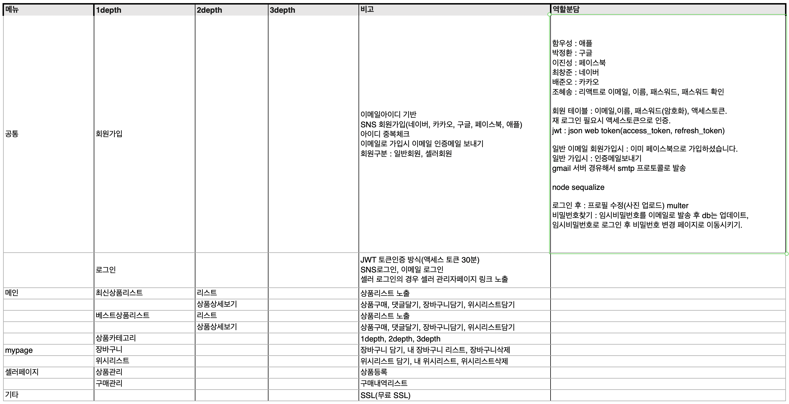

:wave: 안녕하세요 이 repo는 지난 2021년도 2월 5일부터 시작한 웹 스터디의 미션 제출을 목적으로 합니다 :smile:

### :purple_heart: Schedule

|   **Date**   |       Contents       |                   Meeting                    |                          Assignment                          |
|:--------:|:--------:|:--------:|:--------:|
| 2. 5 ~ 2. 7  | 워밍업 능력치 테스트 | 오프라인 : 2.6 토요일 오후 1시 상왕십리 부근 | [바로가기:arrow_upper_right:](https://github.com/jeonghi/NodeStudy/tree/main/board) |
| 2. 8 ~ 2. 14 |  워밍업 마무리 진행  |                    온라인                    | [바로가기:arrow_upper_right:](https://github.com/jeonghi/NodeStudy/tree/main/board) |
| 2.15 ~ 2.23 | 팀프로젝트( 회원가입 구현 ) | 오프라인 : 2.15 , 2.17 오후 8시 상왕십리 부근 | [바로가기:arrow_upper_right:](https://github.com/jeonghi/teampl2021_reactnode) |

### :memo: SRS

### :cyclone: Reference

node.js 200제 :정보문화사 자료실 http://www.infopub.co.kr/index.asp

node.js 교과서 : 길벗 자료실 https://www.gilbut.co.kr/m/book/view?bookcode=BN002827&keyword=node&collection=GB_BOOK

Node.js 웹개발로 알아보는 백엔드 자바스크립트의 이해: 인프런 강좌 https://www.inflearn.com/course/node-js-%EC%9B%B9%EA%B0%9C%EB%B0%9C/dashboard

### :mailbox_with_mail: Contacts
  

